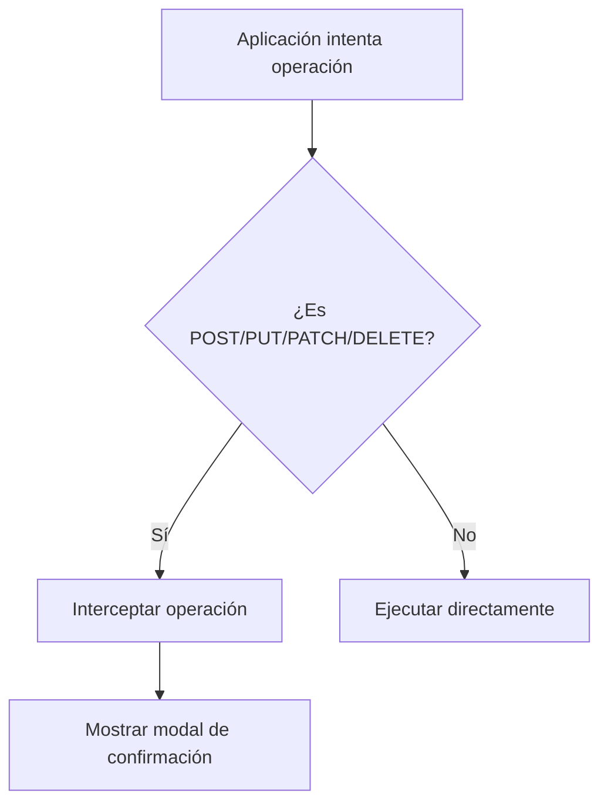
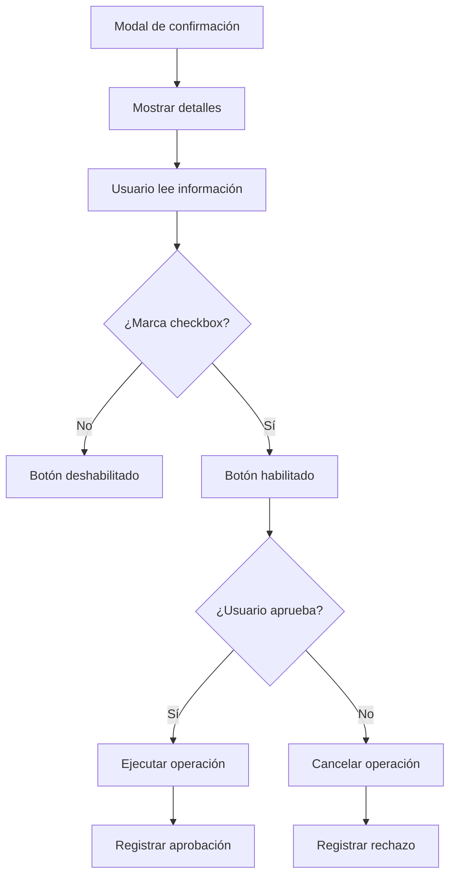

# 🛡️ Sistema de Seguridad API - DataConta

## Visión General

El Sistema de Seguridad API protege contra modificaciones no autorizadas en Siigo mediante confirmación manual del usuario para todas las operaciones peligrosas (POST, PUT, PATCH, DELETE).

## 🎯 Características Principales

### ✅ Funcionalidades de Seguridad
- **Interceptación Automática**: Detecta operaciones peligrosas automáticamente
- **Modal de Confirmación**: Interfaz clara con información detallada
- **Confirmación Obligatoria**: Checkbox requerido para proceder
- **Logging Completo**: Auditoría de todas las operaciones
- **Bloqueo Preventivo**: Sin callback configurado = operación bloqueada

### 📋 Operaciones Interceptadas
- `POST` - Crear nuevos registros
- `PUT` - Actualizar registros completos
- `PATCH` - Actualizar registros parciales  
- `DELETE` - Eliminar registros permanentemente

## 🏗️ Arquitectura del Sistema

### Componentes Principales

#### 1. APISafetyModal (`src/presentation/widgets/api_safety_modal.py`)
- **Responsabilidad**: Mostrar modal de confirmación al usuario
- **Principios SOLID**: SRP, OCP, LSP, ISP, DIP
- **Características**:
  - Información detallada de la operación
  - Advertencias específicas por tipo de operación
  - Confirmación obligatoria con checkbox
  - Diseño responsivo y profesional

#### 2. FreeGUISiigoAdapter (`src/infrastructure/adapters/free_gui_siigo_adapter.py`)
- **Responsabilidad**: Interceptar y validar operaciones HTTP
- **Métodos Clave**:
  - `set_safety_callback()` - Configurar callback de confirmación
  - `_is_dangerous_operation()` - Detectar operaciones peligrosas
  - `_safe_request()` - Ejecutar requests con validación
  - `safe_create_invoice()` - Crear con confirmación
  - `safe_update_invoice()` - Actualizar con confirmación
  - `safe_delete_invoice()` - Eliminar con confirmación

#### 3. FreeGUIController (`src/presentation/controllers/free_gui_controller.py`)
- **Responsabilidad**: Coordinar confirmaciones y mostrar resultados
- **Métodos Clave**:
  - `_setup_api_security()` - Configurar sistema al inicializar
  - `_confirm_dangerous_operation()` - Mostrar modal y procesar resultado
  - `_log_approved_operation()` - Registrar operaciones aprobadas
  - `_log_rejected_operation()` - Registrar operaciones rechazadas

## 🚀 Cómo Usar el Sistema

### Configuración Automática
El sistema se configura automáticamente al inicializar el controlador:

```python
# En FreeGUIController.__init__()
self._setup_api_security()  # Se configura automáticamente
```

### Métodos Seguros Disponibles

```python
# Crear factura con confirmación
try:
    result = controller.safe_create_invoice({
        "document": {"id": 25461},
        "date": "2024-01-15",
        "customer": {"identification": "901229380"},
        "items": [{"code": "Item-1", "quantity": 1, "price": 1500000}]
    })
    print("✅ Factura creada exitosamente")
    
except PermissionError:
    print("🚫 Usuario canceló la operación")
except Exception as e:
    print(f"❌ Error: {e}")
```

```python
# Actualizar factura con confirmación
try:
    result = controller.safe_update_invoice("12345", updated_data)
    print("✅ Factura actualizada exitosamente")
except PermissionError:
    print("🚫 Usuario canceló la operación")
```

```python
# Eliminar factura con confirmación
try:
    success = controller.safe_delete_invoice("12345")
    if success:
        print("✅ Factura eliminada exitosamente")
except PermissionError:
    print("🚫 Usuario canceló la operación")
```

## 🔒 Flujo de Seguridad

### 1. Detección de Operación Peligrosa


### 2. Proceso de Confirmación


## 📊 Tipos de Modal por Operación

### POST - Crear Registro
- **Icono**: 📝
- **Color**: Azul (#2196f3)
- **Título**: "Crear Nuevo Registro"
- **Advertencias**:
  - Se creará un nuevo registro en Siigo
  - Puede afectar reportes y balances
  - Verificar datos antes de continuar

### PUT - Actualizar Completo
- **Icono**: ✏️  
- **Color**: Naranja (#ff9800)
- **Título**: "Actualizar Registro Completo"
- **Advertencias**:
  - Se reemplazará completamente el registro
  - Todos los campos serán sobrescritos
  - Asegurar respaldo de datos actuales

### PATCH - Actualizar Parcial
- **Icono**: 🔧
- **Color**: Naranja (#ff9800)  
- **Título**: "Actualizar Registro Parcial"
- **Advertencias**:
  - Se modificarán campos específicos
  - Puede afectar cálculos automáticos
  - Verificar modificaciones

### DELETE - Eliminar
- **Icono**: 🗑️
- **Color**: Rojo (#f44336)
- **Título**: "ELIMINAR Registro"
- **Advertencias**:
  - ⚠️ PELIGRO: Eliminación permanente
  - ⚠️ NO puede ser deshecha
  - ⚠️ Puede afectar integridad referencial
  - ⚠️ Respaldar datos antes de proceder

## 📝 Logging y Auditoría

### Operación Aprobada
```json
{
  "timestamp": "2024-01-15T10:30:00",
  "action": "OPERATION_APPROVED",
  "method": "POST",
  "endpoint": "https://api.siigo.com/v1/invoices",
  "data_size": 156,
  "user_approved": true
}
```

### Operación Rechazada
```json
{
  "timestamp": "2024-01-15T10:35:00", 
  "action": "OPERATION_REJECTED",
  "method": "DELETE",
  "endpoint": "https://api.siigo.com/v1/invoices/12345",
  "data_size": 0,
  "user_approved": false
}
```

## 🧪 Testing del Sistema

### Ejecutar Demo
```bash
python demo_api_security.py
```

### Casos de Prueba Sugeridos
1. **Operación POST**: Crear factura con datos válidos
2. **Operación PUT**: Actualizar factura existente
3. **Operación DELETE**: Eliminar factura (caso crítico)
4. **Rechazo de Usuario**: Cancelar en modal de confirmación
5. **Sin Callback**: Verificar bloqueo automático

## ⚡ Configuración Avanzada

### Personalizar Callback de Confirmación
```python
def custom_confirmation_callback(method: str, url: str, data: dict) -> bool:
    # Lógica personalizada de confirmación
    if method == "DELETE" and "critical" in url:
        # Requerir doble confirmación para operaciones críticas
        return double_confirm_operation(method, url, data)
    
    # Usar modal estándar para otras operaciones
    return APISafetyModal.confirm_operation(...)

# Configurar callback personalizado
adapter.set_safety_callback(custom_confirmation_callback)
```

## 🛠️ Mantenimiento

### Verificar Sistema Activo
```python
# Verificar si el sistema de seguridad está configurado
if hasattr(adapter, '_safety_callback') and adapter._safety_callback:
    print("✅ Sistema de seguridad activo")
else:
    print("⚠️ Sistema de seguridad no configurado")
```

### Deshabilitar Temporalmente (NO RECOMENDADO)
```python
# Solo para testing o situaciones excepcionales
adapter.set_safety_callback(None)
print("⚠️ Sistema de seguridad DESHABILITADO")
```

## 🔐 Mejores Prácticas

1. **Nunca deshabilitar** el sistema en producción
2. **Revisar logs** regularmente para detectar patrones sospechosos
3. **Capacitar usuarios** sobre la importancia de las confirmaciones
4. **Mantener respaldos** antes de operaciones críticas
5. **Probar regularmente** el sistema con casos de uso reales

## 🚨 Consideraciones de Seguridad

- El sistema NO protege contra ataques externos a la API
- Es una capa de confirmación para errores humanos
- Requiere que el usuario lea y comprenda las advertencias
- Los logs pueden contener información sensible (configurar adecuadamente)

## 📞 Soporte

Para reportar problemas o sugerir mejoras:
1. Revisar logs en `app.log`
2. Verificar configuración del sistema
3. Probar con el demo incluido
4. Documentar pasos para reproducir el problema