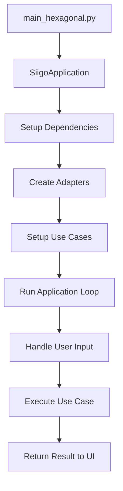

# 🏗️ Arquitectura Hexagonal - DataConta

## 📋 **Visión General**

**DataConta** implementa **Arquitectura Hexagonal** (también conocida como **Ports & Adapters**) siguiendo los principios de **Clean Architecture** y **SOLID** para la integración con la API de Siigo.

## 🎯 **Principios Aplicados**

### **Arquitectura Hexagonal**
- **Puerto (Port)**: Interfaces que definen contratos
- **Adaptador (Adapter)**: Implementaciones concretas de los puertos
- **Dominio**: Lógica de negocio pura, sin dependencias externas
- **Aplicación**: Casos de uso que orquestan la lógica de dominio
- **Infraestructura**: Adaptadores para servicios externos
- **Presentación**: Interfaces de usuario

### **Principios SOLID**
- ✅ **S**ingle Responsibility: Cada clase tiene una responsabilidad específica
- ✅ **O**pen/Closed: Extensible sin modificar código existente  
- ✅ **L**iskov Substitution: Las implementaciones son intercambiables
- ✅ **I**nterface Segregation: Interfaces específicas y cohesivas
- ✅ **D**ependency Inversion: Dependencias se inyectan via interfaces

## 📁 **Estructura de Capas**

```
src/
├── domain/                    # 🎯 DOMINIO (Core Business Logic)
│   ├── entities/             # Entidades de negocio
│   │   └── invoice.py       # Invoice, Customer, InvoiceItem, etc.
│   └── services/            # Servicios de dominio
│
├── application/              # 🔄 APLICACIÓN (Use Cases)
│   ├── ports/               # Puertos (Interfaces)
│   │   └── interfaces.py   # Contratos para adaptadores
│   └── use_cases/          # Casos de uso
│       └── invoice_use_cases.py
│
├── infrastructure/          # 🔌 INFRAESTRUCTURA (Adapters)
│   ├── adapters/           # Implementaciones de puertos
│   │   ├── siigo_api_adapter.py      # API de Siigo
│   │   ├── license_validator_adapter.py # Validación de licencias
│   │   ├── file_storage_adapter.py   # Almacenamiento de archivos
│   │   └── logger_adapter.py         # Logging
│   └── config/             # Configuración
│       └── environment_config.py
│
└── presentation/            # 🖥️ PRESENTACIÓN (UI)
    └── cli_interface.py    # Interfaz de línea de comandos
```

## 🔌 **Puertos (Interfaces)**

### **InvoiceRepository**
```python
class InvoiceRepository(ABC):
    @abstractmethod
    def get_invoices(self, filters: InvoiceFilter) -> List[Invoice]:
        pass
```

### **LicenseValidator** 
```python
class LicenseValidator(ABC):
    @abstractmethod
    def is_license_valid(self, license_key: str) -> bool:
        pass
```

### **FileStorage**
```python
class FileStorage(ABC):
    @abstractmethod
    def save_data(self, data: Dict[str, Any], filename: str) -> str:
        pass
```

### **UserInterface**
```python
class UserInterface(ABC):
    @abstractmethod
    def show_menu(self) -> str:
        pass
```

## 🔧 **Adaptadores (Implementaciones)**

### **SiigoAPIAdapter**
- ✅ Implementa `InvoiceRepository` y `APIClient`
- 🔐 Maneja autenticación con Bearer tokens
- 📡 Realiza llamadas HTTP a la API de Siigo
- 🔄 Convierte JSON a entidades de dominio

### **LicenseValidatorAdapter**
- ✅ Implementa `LicenseValidator`
- 🌐 Validación online contra servidor remoto
- 💻 Fallback a validación offline
- 🧪 Soporte para licencias de demo/prueba

### **FileStorageAdapter**
- ✅ Implementa `FileStorage`
- 💾 Guarda datos en formato JSON
- 📅 Agrega timestamps a archivos
- 📁 Gestiona el directorio de salida

### **CLIUserInterfaceAdapter**
- ✅ Implementa `UserInterface`
- 🖥️ Menú interactivo en consola
- 📋 Captura filtros de usuario
- 📊 Muestra resultados formateados

## 🎯 **Casos de Uso**

### **GetInvoicesUseCase**
```python
def execute(self, request: GetInvoicesRequest, license_key: str) -> GetInvoicesResponse:
    # 1. Validar licencia
    # 2. Crear filtros
    # 3. Obtener facturas del repositorio
    # 4. Guardar en almacenamiento
    # 5. Retornar respuesta
```

### **CheckAPIStatusUseCase**
```python
def execute(self, license_key: str) -> Dict[str, Any]:
    # 1. Validar licencia
    # 2. Probar conexión con API
    # 3. Retornar estado
```

### **ViewStoredFilesUseCase**
```python
def execute(self) -> Dict[str, Any]:
    # 1. Listar archivos almacenados
    # 2. Obtener información de archivos
    # 3. Retornar lista
```

## 🏃‍♂️ **Flujo de Ejecución**



### **1. Inicialización**
```python
# Crear adaptadores
logger = LoggerAdapter(__name__)
siigo_adapter = SiigoAPIAdapter(logger)
license_validator = LicenseValidatorAdapter(license_url, logger)

# Crear casos de uso con inyección de dependencias
get_invoices_use_case = GetInvoicesUseCase(
    siigo_adapter,      # Puerto: InvoiceRepository
    license_validator,  # Puerto: LicenseValidator
    file_storage,      # Puerto: FileStorage
    logger            # Puerto: Logger
)
```

### **2. Ejecución de Caso de Uso**
```python
# La UI solicita datos al usuario
request = GetInvoicesRequest(document_id="1", created_start="2024-01-01")

# El caso de uso ejecuta la lógica de negocio
response = get_invoices_use_case.execute(request, license_key)

# La UI muestra los resultados
ui.display_invoices(response.invoices)
```

## 🧪 **Beneficios de esta Arquitectura**

### **✅ Testabilidad**
- Casos de uso fáciles de testear (mocks de puertos)
- Lógica de dominio aislada
- Adaptadores testeable independientemente

### **🔄 Flexibilidad**  
- Fácil cambiar de API (solo cambiar adaptador)
- Fácil cambiar de UI (CLI → Web → Desktop)
- Fácil agregar nuevos casos de uso

### **🏗️ Mantenibilidad**
- Separación clara de responsabilidades
- Bajo acoplamiento entre capas
- Código limpio y expresivo

### **📈 Escalabilidad**
- Nuevos adaptadores sin modificar core
- Nuevos casos de uso reutilizan puertos existentes
- Fácil integración con nuevos servicios

## 🚀 **Ejecutar la Aplicación**

### **Versión Original (Monolítica)**
```bash
python main.py
```

### **Versión Hexagonal** 
```bash
python main_hexagonal.py
```

## 🔧 **Configuración**

Misma configuración en `.env`:
```env
SIIGO_USER=erikagarcia1179@hotmail.com
SIIGO_ACCESS_KEY=MjNhMTM3M2QtZWU3YS00ZTc5LThjOGQtMmE2ZDg4Y2JmMDQwOmM4WihTNi9+QUU=
PARTNER_ID=SandboxSiigoAPI
LICENSE_KEY=DEMO-TEST-2024-LOCAL
```

## 📊 **Comparación de Arquitecturas**

| Aspecto | Monolítica | Hexagonal |
|---------|-----------|-----------|
| **Testabilidad** | Difícil | Fácil |
| **Flexibilidad** | Limitada | Alta |
| **Mantenibilidad** | Media | Alta |
| **Complejidad** | Baja | Media |
| **Escalabilidad** | Limitada | Alta |

---

**🎉 ¡DataConta ahora implementa Arquitectura Hexagonal completa!**